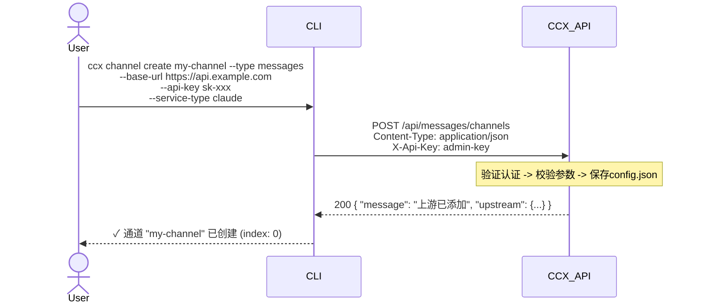
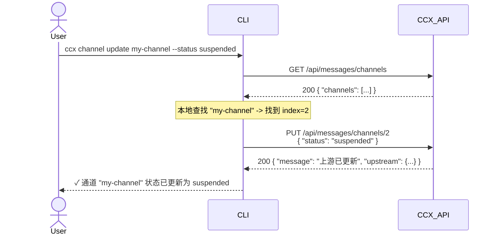
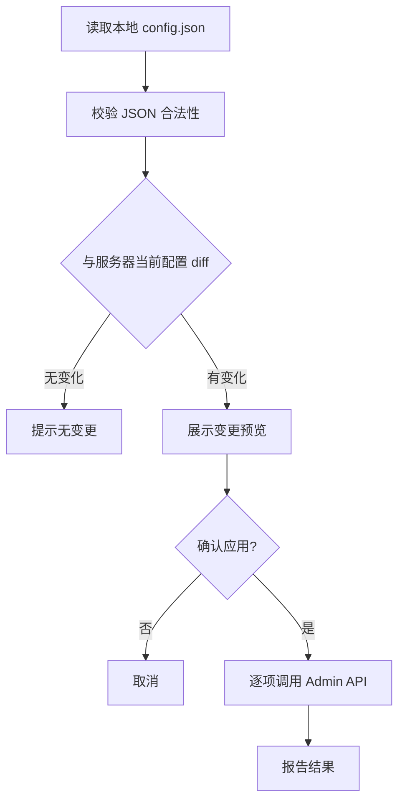
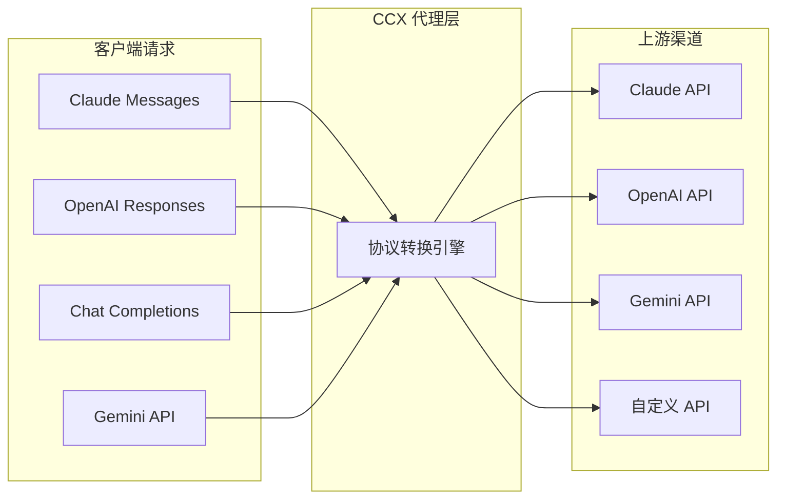

# ccx-cli 命令行工具设计文档

> 版本：v0.1（草案）
> 更新日期：2026-06-22
> 对应 CCX 版本：v2.9.14

---

## 1. 概述

ccx-cli 是 CCX API 代理网关的命令行管理工具，目标是为运维人员提供**无需 Web UI** 的完整配置管理能力。设计遵循 UNIX 哲学——专注单一职责、输出可解析、支持管道组合。

### 1.1 设计原则

- **接口对称**：CLI 子命令与 Admin REST API 一一对应，不做额外抽象
- **输出可控**：支持 `--output json|yaml|table` 三种格式，默认 table
- **配置集成**：默认读取 `~/.config/ccx/config.json`，支持 `--server` 和 `--key` 覆盖
- **错误可操作**：错误信息包含 HTTP 状态码、后端错误原文、修复建议
- **幂等操作**：所有写入操作在失败时提供清晰的错误上下文

### 1.2 技术选型建议

| 层面 | 推荐方案 | 备选 |
|------|---------|------|
| 语言 | Go（与 CCX 同语言，复用类型定义） | Rust / Python |
| CLI 框架 | Cobra + Viper | urfave/cli |
| HTTP 客户端 | Go `net/http` + 自定义 RoundTripper | resty |
| 输出格式化 | tablewriter + encoding/json + gopkg.in/yaml.v3 | — |
| 配置管理 | Viper（支持 `config.yaml`/`config.json`） | — |

---

## 2. 命令树设计

```mermaid
graph TB
    root(ccx) --> channel("channel")
    root --> model("model")
    root --> config("config")
    root --> settings("settings")
    root --> ping("ping")
    root --> health("health")
    root --> help("help")
    root --> completion("completion")

    channel --> channel_list("list")
    channel --> channel_get("get &lt;name&gt;")
    channel --> channel_create("create &lt;name&gt;")
    channel --> channel_update("update &lt;name&gt;")
    channel --> channel_delete("delete &lt;name&gt;")
    channel --> channel_type("--type messages|responses|chat|gemini|images")
    channel --> key("key")
    channel --> status("status")
    channel --> resume("resume")
    channel --> mapping("mapping")
    channel --> reorder("reorder")
    channel --> promotion("promotion")
    channel --> ping_channel("ping")
    channel --> metrics("metrics")
    channel --> logs("logs")
    channel --> dashboard("dashboard")
    channel --> scheduler_stats("scheduler-stats")
    channel --> capability("capability")

    key --> key_add("add &lt;name&gt;")
    key --> key_remove("remove &lt;name&gt;")
    key --> key_list("list &lt;name&gt;")
    key --> key_move("move &lt;name&gt;")
    key --> key_restore("restore &lt;name&gt;")

    status --> status_set("set &lt;name&gt; &lt;active|suspended|disabled&gt;")
    resume --> resume_channel("&lt;name&gt;")

    mapping --> mapping_list("list &lt;name&gt;")
    mapping --> mapping_set("set &lt;name&gt; &lt;source&gt; &lt;target&gt;")

    promotion --> promotion_set("set &lt;name&gt; &lt;duration&gt;")
    promotion --> promotion_clear("clear &lt;name&gt;")

    metrics --> metrics_get("get &lt;name&gt;")
    metrics --> metrics_history("history &lt;name&gt;")

    logs --> logs_get("get &lt;name&gt;")

    dashboard --> dashboard_show("show")

    scheduler_stats --> scheduler_stats_show("show")

    capability --> capability_snapshot("snapshot &lt;name&gt;")
    capability --> capability_test("test &lt;name&gt;")
    capability --> capability_test_status("test-status &lt;name&gt; &lt;jobId&gt;")
    capability --> capability_test_cancel("test-cancel &lt;name&gt; &lt;jobId&gt;")
    capability --> capability_test_retry("test-retry &lt;name&gt; &lt;jobId&gt;")

    model --> model_list("list")

    config --> config_show("show")
    config --> config_apply("apply &lt;file&gt;")
    config --> config_save("save")
    config --> config_backup("backup")
    config --> config_restore("restore &lt;backup-file&gt;")

    settings --> settings_fuzzy("fuzzy")
    settings --> settings_circuit("circuit-breaker")
    settings --> settings_image_limit("image-turn-limit")
    settings --> settings_conversations("conversations")

    settings_fuzzy --> fuzzy_get("get")
    settings_fuzzy --> fuzzy_set("set &lt;true|false&gt;")

    settings_circuit --> circuit_get("get")
    settings_circuit --> circuit_set("set [flags]")

    settings_image_limit --> image_limit_get("get")
    settings_image_limit --> image_limit_set("set &lt;limit&gt;")

    settings_conversations --> conv_settings_get("get")
    settings_conversations --> conv_settings_set("set [flags]")

    root --> conversation("conversation")
    conversation --> conversation_list("list")
    conversation --> conversation_override("override")
    conversation_override --> override_set("set &lt;id&gt;")
    conversation_override --> override_remove("remove &lt;id&gt;")

    ping --> ping_all("（无参数）")
    ping --> ping_single("&lt;name&gt;")
```



---

## 3. 认证方式设计

### 3.1 认证机制

ccx-cli 支持三种认证方式：

1. **`x-api-key` 头**（默认）：将访问密钥放在 `X-Api-Key` 请求头
2. **`Authorization: Bearer`**：将访问密钥放在标准 Bearer Token
3. **`x-goog-api-key` 头**：兼容 Gemini SDK 的认证头（后端已支持）

认证使用后端 `ADMIN_ACCESS_KEY` 环境变量，如果未配置则回退到 `PROXY_ACCESS_KEY`。

> ⚠️ 安全提示：`~/.config/ccx/config.json` 中包含明文 API Key，建议设置文件权限 `chmod 600 ~/.config/ccx/config.json`。

### 3.2 密钥来源（优先级从高到低）

```bash
1. --key "sk-xxx"              # 命令行参数
2. CCX_API_KEY=sk-xxx          # 环境变量
3. ~/.config/ccx/config.json   # CLI 配置文件中的 apiKey 字段
4. 交互式提示                   # stdin 输入（tty 模式）
```

### 3.3 服务器地址来源

```bash
1. --server "http://localhost:3000"  # 命令行参数
2. CCX_SERVER=http://localhost:3000  # 环境变量
3. ~/.config/ccx/config.json         # CLI 配置文件中的 server 字段
4. http://localhost:3000              # 默认值
```

### 3.4 CLI 配置文件 `~/.config/ccx/config.json`

```json
{
  "server": "http://localhost:3000",
  "apiKey": "sk-xxx",
  "defaultType": "messages",
  "output": "table",
  "timeout": "30s"
}
```

### 3.5 TLS/HTTPS 支持

```bash
--ca-cert <path>              # 自定义 CA 证书路径（自签名证书场景）
--insecure-skip-verify        # 跳过证书验证（仅开发/测试环境使用）
```

生产环境中 Admin API 应暴露在 HTTPS 下，CLI 需支持自定义 CA 证书和跳过验证两种模式。

### 3.6 密钥格式前置校验

CLI 在发送请求前应对密钥格式做基本校验，提前给出友好提示而非等待后端返回 401：

| 密钥类型 | 预期前缀 | 校验规则 |
|---------|---------|---------|
| Anthropic | `sk-ant-` | 长度 >= 20 |
| OpenAI | `sk-`/`sk-proj-` | 长度 >= 20 |
| Gemini | `AIzaSy` | 长度 >= 20 |
| 自定义 | — | 非空即可 |

---

## 4. Admin API 映射关系

下表列出了 CLI 命令与后端 API 端点的映射关系（`{type}` = `messages|responses|chat|gemini|images`）：

### 4.1 渠道 CRUD

| CLI 命令 | HTTP 方法 | API 路径 | 说明 |
|----------|-----------|---------|------|
| `ccx channel list --type {type}` | GET | `/api/{type}/channels` | 获取所有通道 |
| `ccx channel get <name> --type {type}` | GET | `/api/{type}/channels` + 本地过滤 | 获取通道详情 ⚠️ 当前为本地过滤模式，通道数多时效率较低 |
| `ccx channel create <name> [flags] --type {type}` | POST | `/api/{type}/channels` | 创建通道 |
| `ccx channel update <name> [flags] --type {type}` | PUT | `/api/{type}/channels/:id` | 更新通道（merge 语义） |
| `ccx channel delete <name> --type {type}` | DELETE | `/api/{type}/channels/:id` | 删除通道 |

### 4.2 API 密钥管理

| CLI 命令 | HTTP 方法 | API 路径 | 说明 |
|----------|-----------|---------|------|
| `ccx channel key add <name> <key> --type {type}` | POST | `/api/{type}/channels/:id/keys` | 添加密钥 |
| `ccx channel key remove <name> <key> --type {type}` | DELETE | `/api/{type}/channels/:id/keys/:apiKey` | 移除密钥 |
| `ccx channel key list <name> --type {type}` | GET | `/api/{type}/channels` + 本地过滤 | 列出密钥 |
| `ccx channel key move <name> <key> --position top --type {type}` | POST | `/api/{type}/channels/:id/keys/:apiKey/top` | 调整密钥优先级到顶部（独立端点） |
| `ccx channel key move <name> <key> --position bottom --type {type}` | POST | `/api/{type}/channels/:id/keys/:apiKey/bottom` | 调整密钥优先级到底部（独立端点） |
| `ccx channel key restore <name> <key> --type {type}` | POST | `/api/{type}/channels/:id/keys/restore` | 恢复被拉黑的密钥（API Key 在请求体 `{"apiKey": "<key>"}` 中传递，**不在 URL 路径中**） |

### 4.3 渠道调度管理

| CLI 命令 | HTTP 方法 | API 路径 | 说明 |
|----------|-----------|---------|------|
| `ccx channel status set <name> active|suspended|disabled --type {type}` | PATCH | `/api/{type}/channels/:id/status` | 设置渠道状态 |
| `ccx channel resume <name> --type {type}` | POST | `/api/{type}/channels/:id/resume` | 恢复熔断/拉黑渠道（重置熔断状态、恢复拉黑 Key，保留历史统计） |
| `ccx channel reorder --type {type} --order name1,name2,...` | POST | `/api/{type}/channels/reorder` | 渠道重排序 |
| `ccx channel promotion set <name> <duration> --type {type}` | POST | `/api/{type}/channels/:id/promotion` | 设置促销期（请求体 `{"duration": <秒数>}`，duration≤0 时清除） |
| `ccx channel promotion clear <name> --type {type}` | POST | `/api/{type}/channels/:id/promotion` | 清除促销期（发送 `{"duration": 0}`，与 set 共用同一 POST 端点） |
| `ccx channel ping <name> --type {type}` | GET | `/api/{type}/ping/:id` | 通道连通性检测 |
| `ccx channel metrics <name> --type {type}` | GET | `/api/{type}/channels/metrics` | 查看通道指标（支持 `?type=` 查询参数过滤） |
| `ccx channel metrics history <name> --type {type}` | GET | `/api/{type}/channels/metrics/history` | 查看通道历史指标 |
| `ccx channel logs <name> --type {type}` | GET | `/api/{type}/channels/:id/logs` | 查看通道请求日志 |
| `ccx channel dashboard --type {type}` | GET | `/api/messages/channels/dashboard` | 统一仪表盘（**非 per-type 端点**，仅 `/api/messages/channels/dashboard` 一处，支持 `?type=messages\|responses\|chat\|gemini\|images`） |
| `ccx channel scheduler-stats --type {type}` | GET | `/api/{type}/channels/scheduler/stats` | 查看调度器统计（messages 和 chat 类型支持） |
| `ccx channel capability snapshot <name> --type {type}` | GET | `/api/{type}/channels/:id/capability-snapshot` | 查看渠道能力快照 |
| `ccx channel capability test <name> --type {type}` | POST | `/api/{type}/channels/:id/capability-test` | 运行渠道能力测试 |
| `ccx channel capability test-status <name> <jobId> --type {type}` | GET | `/api/{type}/channels/:id/capability-test/:jobId` | 查看能力测试任务状态 |
| `ccx channel capability test-cancel <name> <jobId> --type {type}` | DELETE | `/api/{type}/channels/:id/capability-test/:jobId` | 取消能力测试任务 |
| `ccx channel capability test-retry <name> <jobId> --type {type}` | POST | `/api/{type}/channels/:id/capability-test/:jobId/retry` | 重试能力测试中失败的模型 |

### 4.4 模型管理

| CLI 命令 | HTTP 方法 | API 路径 | 说明 |
|----------|-----------|---------|------|
| `ccx model list --type {type} --channel <name>` | POST | `/api/{type}/channels/:id/models` | 列出渠道可用模型（需 `--channel` 指定渠道名称，CLI 先按名称查找 index） |
| `ccx channel mapping list <name> --type {type}` | GET | `/api/{type}/channels` + 本地过滤 | 查看模型映射 ⚠️ 当前为本地过滤模式 |
| `ccx channel mapping set <name> <source> <target> [--reasoning effort] --type {type}` | PUT | `/api/{type}/channels/:id/mappings` | 设置/覆盖模型映射。⚠️ 此为全量替换，调用前 CLI 应提示当前已有映射数 |

### 4.5 全局配置与设置

| CLI 命令 | HTTP 方法 | API 路径 | 说明 |
|----------|-----------|---------|------|
| `ccx config show` | GET | `/api/settings/fuzzy-mode` + `/api/settings/circuit-breaker` + `/api/settings/historical-image-turn-limit` + 遍历各 type 的 `/api/{type}/channels` | 聚合展示全局配置与所有渠道列表 ⚠️ 当前无统一导出端点，需多次聚合调用。考虑后续在后端增加 `GET /admin/config/export` 端点 |
| `ccx config apply <file>` | — | 读取文件 → diff → 逐项调 PUT/POST/DELETE | 应用配置（详见 §8） |
| `ccx config save` | POST | `/admin/config/save` | 强制持久化当前运行时配置到磁盘 |
| `ccx config backup` | GET | 聚合读取所有 `/api/settings/*` 和 `/api/{type}/channels` | 下载完整配置到本地文件 ⚠️ 同 `config show`，需多次调用聚合 |
| `ccx config restore <file>` | — | 读取文件 → `config apply` | 从本地备份文件恢复（复用 apply 流程） |
| `ccx settings fuzzy get` | GET | `/api/settings/fuzzy-mode` | 查看 Fuzzy 模式 |
| `ccx settings fuzzy set <true\|false>` | PUT | `/api/settings/fuzzy-mode` | 设置 Fuzzy 模式 |
| `ccx settings circuit-breaker get` | GET | `/api/settings/circuit-breaker` | 查看熔断器配置 |
| `ccx settings circuit-breaker set [flags]` | PUT | `/api/settings/circuit-breaker` | 设置熔断器配置 |
| `ccx settings image-turn-limit get` | GET | `/api/settings/historical-image-turn-limit` | 查看图片轮次限制 |
| `ccx settings image-turn-limit set <limit>` | PUT | `/api/settings/historical-image-turn-limit` | 设置图片轮次限制 |
| `ccx settings conversations get` | GET | `/api/conversations/settings` | 查看对话设置 |
| `ccx settings conversations set [flags]` | PUT | `/api/conversations/settings` | 更新对话设置 |
| `ccx conversation list` | GET | `/api/conversations` | 列出活跃对话 |
| `ccx conversation override set <id>` | POST | `/api/conversations/:id/override` | 设置对话覆盖 |
| `ccx conversation override remove <id>` | DELETE | `/api/conversations/:id/override` | 移除对话覆盖 |

### 4.6 监控与诊断

| CLI 命令 | HTTP 方法 | API 路径 | 说明 |
|----------|-----------|---------|------|
| `ccx health` | GET | `/health` | 服务健康检查 |
| `ccx health --prefix my-prefix` | GET | `/:routePrefix/health` | 带路由前缀的健康检查（如 Docker 部署中路由前缀非空时使用） |
| `ccx ping` | GET | `/api/{type}/ping`（遍历所有 type） | 全局连通性检测 |
| `ccx channel ping <name> --type {type}` | GET | `/api/{type}/ping/:id` | 单个通道连通性检测 |

---

## 5. `--type` 设计

CCX 有 5 种独立渠道类型，CLI 通过 `--type`（短名 `-t`）区分：

| 取值 | 对应的 config 字段 | 代理协议 |
|------|-------------------|---------|
| `messages`（默认）| `upstream` | Claude Messages API |
| `responses` | `responsesUpstream` | OpenAI Responses API |
| `chat` | `chatUpstream` | OpenAI Chat Completions API |
| `gemini` | `geminiUpstream` | Google Gemini API |
| `images` | `imagesUpstream` | OpenAI Images API |

设计决策：`--type` 作为**全局 flag** 作用于子命令，而非子命令的前缀：

```bash
# 推荐：全局 flag
ccx channel list --type responses
ccx channel create my-channel --type chat --base-url https://...

# 不推荐：命令前缀（过于冗长）
ccx responses channel list
ccx chat channel create my-channel
```

> ⚠️ 注意：`--type` 仅对 `channel`、`model`、`ping` 命令有意义。`health`、`config`、`settings`、`conversation`、`completion`、`help` 等命令不受 `--type` 影响，指定了也会被忽略。

---

## 6. 交互流程

### 6.1 创建通道



### 6.2 更新通道（部分更新）

后端 `PUT /api/{type}/channels/:id` 使用 `UpstreamUpdate` 结构体（全部为指针字段），直接支持 merge 语义——仅发送需要变更的字段，未提供的字段保持不变。



> ⚠️ 注意：后端使用 `PUT` 方法，但实际行为是 **merge 语义**（因为 `UpstreamUpdate` 所有字段均为指针类型，未设置字段不发送）。这与标准 HTTP PUT 的全量替换语义不同，实现时需注意。如果不发送某字段，该字段将保持不变。

### 6.3 配置热重载支持

由于 CCX 后端内置 `fsnotify` 监听 `config.json` 文件变更，以下两种方式均可触发热重载：

1. **通过 API 修改（推荐）**：CLI 调用 Admin API → 后端修改 `config.json` → `fsnotify` 自动触发重载 → 配置生效
2. **直接写文件**：`ccx config apply file.json` → CLI 将整个 `config.json` 写入服务器文件 → `fsnotify` 自动触发重载

方案 2 需要服务器端有对应的文件写入端点（当前通过 `POST /admin/config/save` 触发），或者通过 SCP/卷映射直接替换文件。

---

## 7. 输出格式设计

### 7.1 输出控制

所有命令支持 `--output` / `-o` 参数：

| 格式 | 值 | 适用场景 |
|------|-----|---------|
| Table | `table`（默认） | 人眼阅读，适合终端交互 |
| JSON | `json` | 管道传递给 `jq` 或其他工具 |
| YAML | `yaml` | 配置文件生成、版本管理 |

### 7.2 输出示例

**Table 模式：通道列表**

```text
 索引  名称             类型      状态      BaseURL                    优先级   延迟
───── ──────────────── ──────── ──────── ────────────────────────── ──────── ──────
 0    claude-direct    claude   active   https://api.anthropic.com   0        123ms
 1    openai-gpt       openai   active   https://api.openai.com      1        —
 2    gemini-pro       gemini   suspended https://generativelanguage.googleapis.com  2  —
```

**JSON 模式：通道详情**

```json
{
  "index": 0,
  "name": "claude-direct",
  "serviceType": "claude",
  "baseUrl": "https://api.anthropic.com",
  "status": "active",
  "priority": 0,
  "apiKeys": ["sk-ant-xxx...", "sk-ant-yyy..."],
  "modelMapping": {
    "claude-sonnet-4": "claude-sonnet-4-20250514"
  }
}
```

### 7.3 敏感信息处理

- API Key 默认只显示前 4 位和后 4 位：`sk-a***xxx`
- 使用 `--show-keys` 标志显示完整密钥（需要确认）
- 输出到文件时自动脱敏（可通过 `--no-mask` 覆盖）

---

## 8. `ccx config apply` 工作流

`ccx config apply <file>` 是批量配置场景的核心命令：



变更检测算法：

```
backend-go 中已有 hasConfigChanged() 方法，但该方法为**未导出**（小写首字母），
CLI 无法直接调用。CLI 需自行实现 JSON diff：
- 方案 A：深层 JSON 比对（json.Marshal + bytes.Equal，与 backend 策略一致）
- 方案 B：使用第三方库如 gojsondiff、jsondiff
推荐方案 A，逻辑简单且与后端行为对齐。
```

---

## 9. 错误处理策略

### 9.1 错误分类

| 错误类型 | HTTP 状态码 | CLI 行为 |
|----------|------------|---------|
| 认证失败 | 401 | 输出 `✗ 认证失败：请检查 --key 或 CCX_API_KEY`，退出码 1 |
| 资源未找到 | 404 | 输出 `✗ 未找到名为 "xxx" 的通道`，退出码 1 |
| 资源冲突 | 409 | 输出 `✗ 同名渠道已存在`（创建时）或 `✗ 名称已被占用`（重命名时），退出码 1 |
| 请求参数错误 | 400 | 输出后端返回的详细错误，退出码 1 |
| 限流 | 429 | 输出 `✗ 请求过于频繁，请在 {retry-after} 秒后重试`，退出码 5 |
| 服务器错误 | 500 | 输出 `✗ 服务器内部错误：{后端错误原文}`，退出码 2 |
| 服务不可用 | 502/503 | 自动重试（最多 3 次，间隔 1s/2s/4s），重试耗尽后退出码 2 |
| 连接失败 | — | 输出 `✗ 无法连接到服务器 {url}`，退出码 3 |
| 超时 | — | 输出 `✗ 请求超时`，退出码 4 |

### 9.2 重试策略

对于瞬时性故障（HTTP 502/503、连接重置），CLI 应支持自动重试：

```go
// 重试配置
retryMax:  3                    // 最大重试次数
retryWait: 1s / 2s / 4s        // 退避间隔（指数增长）
retryJitter: 100ms             // 随机抖动防止惊群
```

- 幂等操作（GET、DELETE、PUT 全量替换）可以安全重试
- 非幂等操作（POST 创建）不应自动重试
- 可通过 `--retry` 标志覆盖默认重试次数，`--no-retry` 关闭重试

### 9.3 退出码规范

| 退出码 | 含义 |
|-------|------|
| 0 | 成功 |
| 1 | 用户错误（参数错误、认证失败、资源不存在） |
| 2 | 服务器错误（后端异常、配置保存失败） |
| 3 | 网络错误（连接失败、DNS 解析失败） |
| 4 | 超时 |
| 5 | 限流（HTTP 429） |
| 6 | 配置校验错误（`config apply` 校验失败） |

---

## 10. 配置热重载与文件写入

当前后端热重载机制：

```go
// config_loader.go: startWatcher()
// 使用 fsnotify 监听配置目录
// 防抖窗口 100ms（configReloadDebounce）
// 三种变更事件：Write/Create/Rename
```

CLI 设计需利用此机制：

1. **方案 A — 通过 Admin API（推荐）**：所有修改通过 API 写入，后端自动持久化到 `config.json` → `fsnotify` 触发重载
2. **方案 B — 直接写文件**：ccx 端提供 `POST /admin/config/save` 端点直接覆盖 `config.json` 内容并触发重载
3. **方案 C — 本地编辑远程推送**：CLI 下载当前配置 → 本地编辑 → `ccx config apply` 推送回去

---

## 11. 协议转换说明

ccx-cli 不直接实现协议转换逻辑，但需要帮助用户理解渠道的**协议关联**：

### 协议转换链路



### Responses → Chat 转换示例

```
ccx model list 显示时，如果渠道 serviceType=openai 但类型是 responses，
CLI 应提示："此 channels 属于 responses 类型，但上游为 openai 协议，
请求将由 CCX 自动转换为 Chat Completions 后发送"
```

---

## 12. 关键命令行参数汇总

### 全局参数

| 参数 | 默认值 | 说明 |
|------|-------|------|
| `--server`, `-s` | `http://localhost:3000` | CCX 服务地址 |
| `--key`, `-k` | — | 管理 API 密钥 |
| `--type`, `-t` | `messages` | 渠道类型（仅 channel/model/ping 命令需要） |
| `--output`, `-o` | `table` | 输出格式 |
| `--timeout` | `30s` | 请求超时时间 |
| `--retry` | `3` | 最大重试次数（瞬时故障） |
| `--no-retry` | `false` | 关闭自动重试 |
| `--config` | `~/.config/ccx/config.json` | CLI 自身配置文件 |
| `--prefix` | — | 路由前缀（对应 `/:routePrefix/health` 健康检查） |
| `--verbose` | `false` | 显示详细请求信息 |
| `--ca-cert` | — | 自定义 CA 证书路径 |
| `--insecure-skip-verify` | `false` | 跳过 TLS 证书验证 |

### `ccx channel create` 关键参数

```bash
--base-url, -u       string    上游 BaseURL
--api-key, -a        []string  API Key（可重复）
--service-type       string    服务类型（claude/openai/gemini）
--status             string    初始状态（active/suspended/disabled）
--priority           int       优先级
--description        string    描述信息
--website            string    网站
--model-mapping      strings   模型映射（key=value 格式，可重复，如 "claude-sonnet-4=gpt-4o"）
--proxy-url          string    代理地址
--auth-header        string    认证头覆盖
```

### `ccx channel update` 语义说明

`channel update` 使用 **merge 语义**：仅更新命令行指定的字段，未指定的字段保持不变。

与子命令的关系：

| 变更类型 | 推荐命令 | 替代方式 |
|---------|---------|---------|
| 修改基础信息（base-url、description、priority 等） | `channel update` | — |
| 修改状态 | `channel status set` | `channel update --status`（功能等价） |
| 修改模型映射 | `channel mapping set` | `channel update --model-mapping`（⚠️ 全量替换，非追加） |

> 注意：`channel update --model-mapping` 是**全量替换**操作，会覆盖通道上已有的所有模型映射。如需增量添加/修改单个映射，使用 `channel mapping set`。

### `ccx channel mapping set` 关键参数

```bash
--reasoning   string    推理级别（low/medium/high，仅兼容渠道支持）
```

---

## 13. 实现优先级与路线图

| 阶段 | 命令 | 说明 |
|------|------|------|
| P0（MVP） | `channel list/get/create/delete`、`key add/remove`、`health`、`ping`、`completion` | 核心 CRUD 与诊断、Shell 补全 |
| P1 | `channel update`、`status set`、`mapping set`、`resume`、`config show/save`、`settings fuzzy/circuit/image-limit`、`settings conversations` | 配置管理扩展与运行时设置 |
| P2 | `config apply/backup/restore`、`channel metrics/logs/dashboard`、`conversation list/override` | 批量运维与监控诊断 |
| P3 | `channel promotion`、`reorder`、`channel ping`、`channel capability`、`channel scheduler-stats` | 高级调度与精细化运维 |

---

## 14. 项目目录结构

```
|ccx/ (fork of BenedictKing/ccx)|
|├── cli/ (ccx-cli)                     # ← 本工具现在在这里
├── main.go                 # 入口
├── cmd/
│   ├── root.go             # 根命令 + 全局参数
│   ├── channel.go          # channel 子命令
│   ├── channel_list.go     # channel list
│   ├── channel_get.go      # channel get
│   ├── channel_create.go   # channel create
│   ├── channel_update.go   # channel update
│   ├── channel_delete.go   # channel delete
│   ├── channel_key.go      # channel key 子命令
│   ├── channel_status.go   # channel status 子命令
│   ├── channel_mapping.go  # channel mapping 子命令
│   ├── channel_reorder.go  # channel reorder
│   ├── channel_promotion.go# channel promotion
│   ├── channel_ping.go     # channel ping
│   ├── channel_metrics.go  # channel metrics
│   ├── channel_logs.go     # channel logs
│   ├── channel_dashboard.go# channel dashboard
│   ├── channel_scheduler.go# channel scheduler-stats
│   ├── channel_capability.go# channel capability
│   ├── model.go            # model 子命令
│   ├── config_cmd.go       # config 子命令
│   ├── settings.go         # settings 子命令
│   ├── conversation.go     # conversation 子命令
│   ├── health.go           # health 子命令
│   ├── ping.go             # ping 子命令
│   └── completion.go       # shell 补全
├── internal/
│   ├── client/
│   │   └── client.go       # CCX API 客户端（含认证、重试、超时、限流处理）
│   ├── config/
│   │   └── config.go       # CLI 自身配置管理
│   ├── formatter/
│   │   └── formatter.go    # table/json/yaml 格式化输出
│   ├── diff/
│   │   └── diff.go         # JSON diff 工具（config apply 用）
│   ├── validator/
│   │   └── validator.go    # 参数校验（密钥格式、URL 格式等）
│   ├── errors/
│   │   └── errors.go       # 自定义错误类型与退出码定义
│   └── models/
│       └── types.go        # 与 CCX 类型对齐的数据结构
├── test/
│   ├── integration/        # 集成测试（需真实或 mock 服务）
│   └── fixtures/           # 测试 fixture（样例 config.json 等）
├── go.mod
├── go.sum
├── Makefile
└── README.md
```
